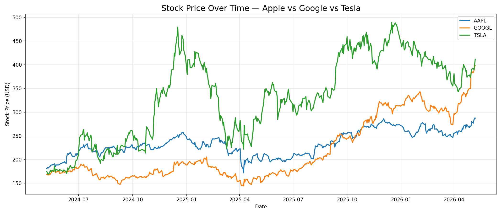
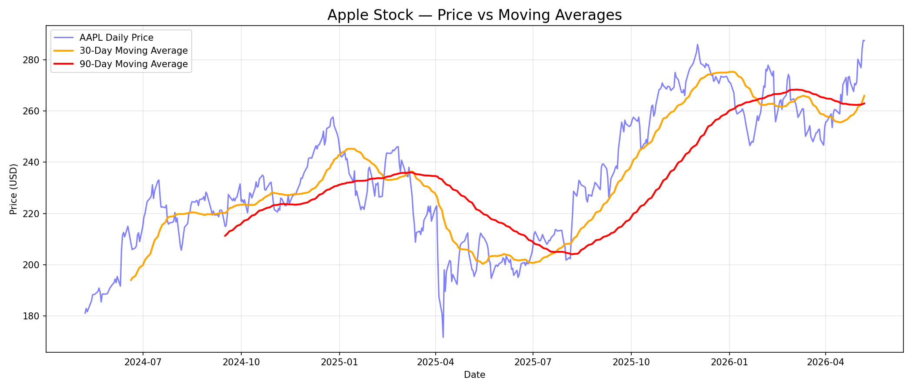
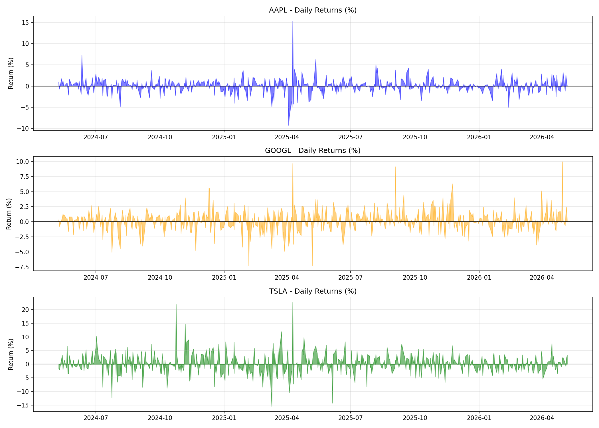
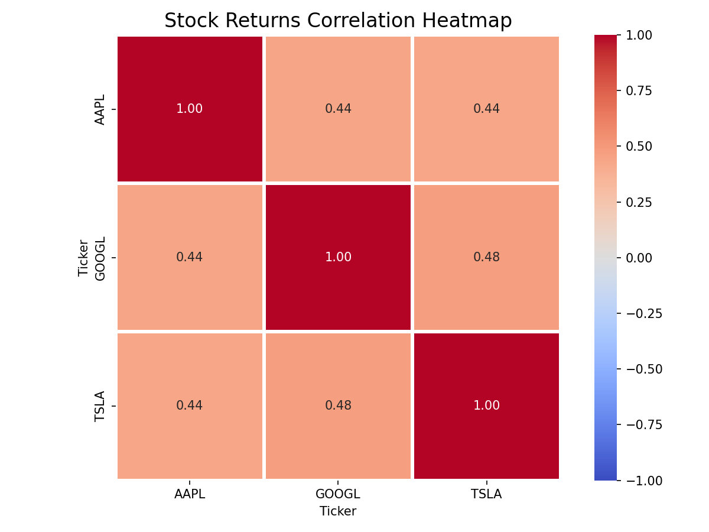

# 📈 Stock Market Analysis

Analyzed 2 years of real stock data for Apple, Google & Tesla.

## 📊 Key Findings
- Tesla had highest return (+0.24%/day) but most risky!
- Apple was the safest & most stable stock
- Google had best balance of risk vs reward
- April 2025 crash — Trump tariffs caused Apple -10% in one day!

## 📈 Visualizations

## 🛠️ Tools Used
Python | Pandas | yfinance | Matplotlib | Seaborn

## ▶️ How to Run
pip install yfinance
jupyter notebook stock_market_analysis.ipynb
